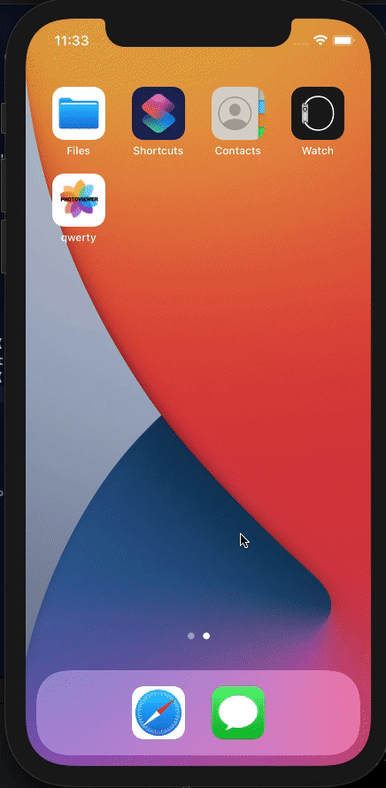

# Interface Programming Final Proj Team 6 Repository

## Photo Viewer App using unsplash api



## Ideation
- enable photo downloading


## How to use the repo
- ```git clone url https://github.com/joey0320/InterfaceProgramming-Team6.git```
- go to repo and click on qwert.xcodeproj
- cmd + R to build and run the app !!


## Contributions
- 김수빈 : code
- 윤아람 : code & app design
- 황보준호 : code


check out the commit logs for more information!!
we leave the working branchs for further development!
